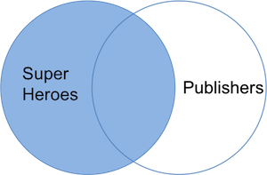
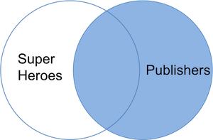
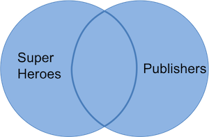
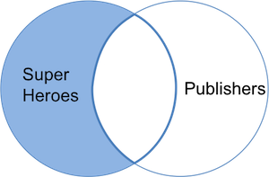
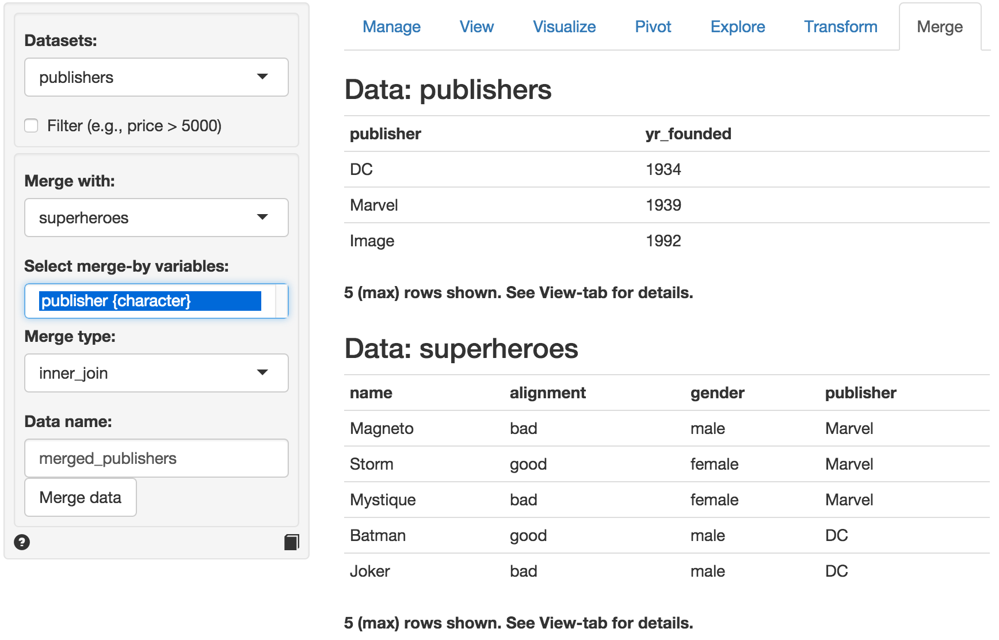

> Combine two datasets

<!-- Change Data > Merge to Data > Combine and add intersect(), union(), setdiff(), bind_rows() and bind_cols(). For intersect etc. another dataset with the same variables would be need (i.e., more publishers or more heroes). Start the discussion with bind_* to show that these may not always give you what you actually want, i.e., you may end up with duplicate rows/columns. -->

There are six merge (or join) options available in Radiant from the [dplyr](http://www.rdocumentation.org/packages/dplyr) package developed by Hadley Wickham and Romain Francois on [GitHub](https://github.com/hadley/dplyr).

The examples below are adapted from [Cheatsheet for dplyr join functions](http://stat545-ubc.github.io/bit001_dplyr-cheatsheet.html) by Jenny Bryan and focus on two small datasets, `superheroes` and `publishers`, to illustrate the different merge / join types.

<table class='table table-condensed table-hover' style='width:70%;'>
<caption>Superheroes</caption>
 <thead>
  <tr>
   <th style="text-align:left;"> name </th>
   <th style="text-align:left;"> alignment </th>
   <th style="text-align:left;"> gender </th>
   <th style="text-align:left;"> publisher </th>
  </tr>
 </thead>
<tbody>
  <tr>
   <td style="text-align:left;"> Magneto </td>
   <td style="text-align:left;"> bad </td>
   <td style="text-align:left;"> male </td>
   <td style="text-align:left;"> Marvel </td>
  </tr>
  <tr>
   <td style="text-align:left;"> Storm </td>
   <td style="text-align:left;"> good </td>
   <td style="text-align:left;"> female </td>
   <td style="text-align:left;"> Marvel </td>
  </tr>
  <tr>
   <td style="text-align:left;"> Mystique </td>
   <td style="text-align:left;"> bad </td>
   <td style="text-align:left;"> female </td>
   <td style="text-align:left;"> Marvel </td>
  </tr>
  <tr>
   <td style="text-align:left;"> Batman </td>
   <td style="text-align:left;"> good </td>
   <td style="text-align:left;"> male </td>
   <td style="text-align:left;"> DC </td>
  </tr>
  <tr>
   <td style="text-align:left;"> Joker </td>
   <td style="text-align:left;"> bad </td>
   <td style="text-align:left;"> male </td>
   <td style="text-align:left;"> DC </td>
  </tr>
  <tr>
   <td style="text-align:left;"> Catwoman </td>
   <td style="text-align:left;"> bad </td>
   <td style="text-align:left;"> female </td>
   <td style="text-align:left;"> DC </td>
  </tr>
  <tr>
   <td style="text-align:left;"> Hellboy </td>
   <td style="text-align:left;"> good </td>
   <td style="text-align:left;"> male </td>
   <td style="text-align:left;"> Dark Horse Comics </td>
  </tr>
</tbody>
</table>

<table class='table table-condensed table-hover' style='width:30%;'>
<caption>Publishers</caption>
 <thead>
  <tr>
   <th style="text-align:left;"> publisher </th>
   <th style="text-align:left;"> yr_founded </th>
  </tr>
 </thead>
<tbody>
  <tr>
   <td style="text-align:left;"> DC </td>
   <td style="text-align:left;"> 1934 </td>
  </tr>
  <tr>
   <td style="text-align:left;"> Marvel </td>
   <td style="text-align:left;"> 1939 </td>
  </tr>
  <tr>
   <td style="text-align:left;"> Image </td>
   <td style="text-align:left;"> 1992 </td>
  </tr>
</tbody>
</table>

In the screen-shot of the Data > Merge tab below we see the two datasets. The tables share the variable _publisher_ which is automatically selected for the merge / join. Different merge / join options are available from the `Merge type` dropdown. You can also specify a name for the merged dataset in the `Data name` text input box.


<br>

### Inner join (superheroes, publishers)

If x = superheroes and y = publishers:

> An inner join returns all rows from x with matching values in y, and all columns from both x and y. If there are multiple matches between x and y, all match combinations are returned.

<table class='table table-condensed table-hover' style='width:70%;'>
 <thead>
  <tr>
   <th style="text-align:left;"> name </th>
   <th style="text-align:left;"> alignment </th>
   <th style="text-align:left;"> gender </th>
   <th style="text-align:left;"> publisher </th>
   <th style="text-align:left;"> yr_founded </th>
  </tr>
 </thead>
<tbody>
  <tr>
   <td style="text-align:left;"> Magneto </td>
   <td style="text-align:left;"> bad </td>
   <td style="text-align:left;"> male </td>
   <td style="text-align:left;"> Marvel </td>
   <td style="text-align:left;"> 1939 </td>
  </tr>
  <tr>
   <td style="text-align:left;"> Storm </td>
   <td style="text-align:left;"> good </td>
   <td style="text-align:left;"> female </td>
   <td style="text-align:left;"> Marvel </td>
   <td style="text-align:left;"> 1939 </td>
  </tr>
  <tr>
   <td style="text-align:left;"> Mystique </td>
   <td style="text-align:left;"> bad </td>
   <td style="text-align:left;"> female </td>
   <td style="text-align:left;"> Marvel </td>
   <td style="text-align:left;"> 1939 </td>
  </tr>
  <tr>
   <td style="text-align:left;"> Batman </td>
   <td style="text-align:left;"> good </td>
   <td style="text-align:left;"> male </td>
   <td style="text-align:left;"> DC </td>
   <td style="text-align:left;"> 1934 </td>
  </tr>
  <tr>
   <td style="text-align:left;"> Joker </td>
   <td style="text-align:left;"> bad </td>
   <td style="text-align:left;"> male </td>
   <td style="text-align:left;"> DC </td>
   <td style="text-align:left;"> 1934 </td>
  </tr>
  <tr>
   <td style="text-align:left;"> Catwoman </td>
   <td style="text-align:left;"> bad </td>
   <td style="text-align:left;"> female </td>
   <td style="text-align:left;"> DC </td>
   <td style="text-align:left;"> 1934 </td>
  </tr>
</tbody>
</table>

In the table above we lose _Hellboy_ because, although this hero does appear in `superheroes`, the publisher (_Dark Horse Comics_) does not appear in `publishers`. The join result has all variables from `superheroes`, plus _yr\_founded_, from `publishers`. We can visualize an inner join with the venn-diagram below:


The command that Radiant uses internally is:

```r
mergedata("superheroes", "publishers", merge_vars = "publisher", merge_type = "inner_join", merge_name = "merged_superheroes")
```

The same result can be achieved with the following R-code:

```r
merged_superheroes <- inner_join(superheroes, publishers, by = "publisher")
```

<br>

### Left join (superheroes, publishers)

> A left join returns all rows from x, and all columns from x and y. If there are multiple matches between x and y, all match combinations are returned.

<table class='table table-condensed table-hover' style='width:70%;'>
 <thead>
  <tr>
   <th style="text-align:left;"> name </th>
   <th style="text-align:left;"> alignment </th>
   <th style="text-align:left;"> gender </th>
   <th style="text-align:left;"> publisher </th>
   <th style="text-align:left;"> yr_founded </th>
  </tr>
 </thead>
<tbody>
  <tr>
   <td style="text-align:left;"> Magneto </td>
   <td style="text-align:left;"> bad </td>
   <td style="text-align:left;"> male </td>
   <td style="text-align:left;"> Marvel </td>
   <td style="text-align:left;"> 1939 </td>
  </tr>
  <tr>
   <td style="text-align:left;"> Storm </td>
   <td style="text-align:left;"> good </td>
   <td style="text-align:left;"> female </td>
   <td style="text-align:left;"> Marvel </td>
   <td style="text-align:left;"> 1939 </td>
  </tr>
  <tr>
   <td style="text-align:left;"> Mystique </td>
   <td style="text-align:left;"> bad </td>
   <td style="text-align:left;"> female </td>
   <td style="text-align:left;"> Marvel </td>
   <td style="text-align:left;"> 1939 </td>
  </tr>
  <tr>
   <td style="text-align:left;"> Batman </td>
   <td style="text-align:left;"> good </td>
   <td style="text-align:left;"> male </td>
   <td style="text-align:left;"> DC </td>
   <td style="text-align:left;"> 1934 </td>
  </tr>
  <tr>
   <td style="text-align:left;"> Joker </td>
   <td style="text-align:left;"> bad </td>
   <td style="text-align:left;"> male </td>
   <td style="text-align:left;"> DC </td>
   <td style="text-align:left;"> 1934 </td>
  </tr>
  <tr>
   <td style="text-align:left;"> Catwoman </td>
   <td style="text-align:left;"> bad </td>
   <td style="text-align:left;"> female </td>
   <td style="text-align:left;"> DC </td>
   <td style="text-align:left;"> 1934 </td>
  </tr>
  <tr>
   <td style="text-align:left;"> Hellboy </td>
   <td style="text-align:left;"> good </td>
   <td style="text-align:left;"> male </td>
   <td style="text-align:left;"> Dark Horse Comics </td>
   <td style="text-align:left;"> NA </td>
  </tr>
</tbody>
</table>

The join result contains `superheroes` with variable `yr_founded` from `publishers`. _Hellboy_, whose publisher does not appear in `publishers`, has an `NA` for _yr_founded_. We can visualize a left join with the venn-diagram below:



The command that Radiant uses internally is:

```r
mergedata("superheroes", "publishers", merge_vars = "publisher", merge_type = "left_join", merge_name = "merged_superheroes")
```

The same result can be achieved with the following R-code:

```r
merged_superheroes <- left_join(superheroes, publishers, by = "publisher")
```

<br>

### Right join (superheroes, publishers)

> A right join returns all rows from y, and all columns from y and x. If there are multiple matches between y and x, all match combinations are returned.

<table class='table table-condensed table-hover' style='width:70%;'>
 <thead>
  <tr>
   <th style="text-align:left;"> name </th>
   <th style="text-align:left;"> alignment </th>
   <th style="text-align:left;"> gender </th>
   <th style="text-align:left;"> publisher </th>
   <th style="text-align:left;"> yr_founded </th>
  </tr>
 </thead>
<tbody>
  <tr>
   <td style="text-align:left;"> Batman </td>
   <td style="text-align:left;"> good </td>
   <td style="text-align:left;"> male </td>
   <td style="text-align:left;"> DC </td>
   <td style="text-align:left;"> 1934 </td>
  </tr>
  <tr>
   <td style="text-align:left;"> Joker </td>
   <td style="text-align:left;"> bad </td>
   <td style="text-align:left;"> male </td>
   <td style="text-align:left;"> DC </td>
   <td style="text-align:left;"> 1934 </td>
  </tr>
  <tr>
   <td style="text-align:left;"> Catwoman </td>
   <td style="text-align:left;"> bad </td>
   <td style="text-align:left;"> female </td>
   <td style="text-align:left;"> DC </td>
   <td style="text-align:left;"> 1934 </td>
  </tr>
  <tr>
   <td style="text-align:left;"> Magneto </td>
   <td style="text-align:left;"> bad </td>
   <td style="text-align:left;"> male </td>
   <td style="text-align:left;"> Marvel </td>
   <td style="text-align:left;"> 1939 </td>
  </tr>
  <tr>
   <td style="text-align:left;"> Storm </td>
   <td style="text-align:left;"> good </td>
   <td style="text-align:left;"> female </td>
   <td style="text-align:left;"> Marvel </td>
   <td style="text-align:left;"> 1939 </td>
  </tr>
  <tr>
   <td style="text-align:left;"> Mystique </td>
   <td style="text-align:left;"> bad </td>
   <td style="text-align:left;"> female </td>
   <td style="text-align:left;"> Marvel </td>
   <td style="text-align:left;"> 1939 </td>
  </tr>
  <tr>
   <td style="text-align:left;"> NA </td>
   <td style="text-align:left;"> NA </td>
   <td style="text-align:left;"> NA </td>
   <td style="text-align:left;"> Image </td>
   <td style="text-align:left;"> 1992 </td>
  </tr>
</tbody>
</table>

The join result contains all rows and colums from `publishers` and all variables from `superheroes`. We lose _Hellboy_, whose publisher does not appear in `publishers`. _Image_ is retained in the table but has `NA` values for the variables _name_, _alignment_, and _gender_ from `superheroes`. Notice that a join can change both the row and variable order so you should not rely on these in your analysis. We can visualize a right join with the venn-diagram below:



The command that Radiant uses internally is:

```r
mergedata("superheroes", "publishers", merge_vars = "publisher", merge_type = "right_join", merge_name = "merged_superheroes")
```

The same result can be achieved with the following R-code:

```r
merged_superheroes <- right_join(superheroes, publishers, by = "publisher")
```

<br>

### Full join (superheroes, publishers)

> A full join combines two datasets, keeping rows and columns that appear in either.

<table class='table table-condensed table-hover' style='width:70%;'>
 <thead>
  <tr>
   <th style="text-align:left;"> name </th>
   <th style="text-align:left;"> alignment </th>
   <th style="text-align:left;"> gender </th>
   <th style="text-align:left;"> publisher </th>
   <th style="text-align:left;"> yr_founded </th>
  </tr>
 </thead>
<tbody>
  <tr>
   <td style="text-align:left;"> Magneto </td>
   <td style="text-align:left;"> bad </td>
   <td style="text-align:left;"> male </td>
   <td style="text-align:left;"> Marvel </td>
   <td style="text-align:left;"> 1939 </td>
  </tr>
  <tr>
   <td style="text-align:left;"> Storm </td>
   <td style="text-align:left;"> good </td>
   <td style="text-align:left;"> female </td>
   <td style="text-align:left;"> Marvel </td>
   <td style="text-align:left;"> 1939 </td>
  </tr>
  <tr>
   <td style="text-align:left;"> Mystique </td>
   <td style="text-align:left;"> bad </td>
   <td style="text-align:left;"> female </td>
   <td style="text-align:left;"> Marvel </td>
   <td style="text-align:left;"> 1939 </td>
  </tr>
  <tr>
   <td style="text-align:left;"> Batman </td>
   <td style="text-align:left;"> good </td>
   <td style="text-align:left;"> male </td>
   <td style="text-align:left;"> DC </td>
   <td style="text-align:left;"> 1934 </td>
  </tr>
  <tr>
   <td style="text-align:left;"> Joker </td>
   <td style="text-align:left;"> bad </td>
   <td style="text-align:left;"> male </td>
   <td style="text-align:left;"> DC </td>
   <td style="text-align:left;"> 1934 </td>
  </tr>
  <tr>
   <td style="text-align:left;"> Catwoman </td>
   <td style="text-align:left;"> bad </td>
   <td style="text-align:left;"> female </td>
   <td style="text-align:left;"> DC </td>
   <td style="text-align:left;"> 1934 </td>
  </tr>
  <tr>
   <td style="text-align:left;"> Hellboy </td>
   <td style="text-align:left;"> good </td>
   <td style="text-align:left;"> male </td>
   <td style="text-align:left;"> Dark Horse Comics </td>
   <td style="text-align:left;"> NA </td>
  </tr>
  <tr>
   <td style="text-align:left;"> NA </td>
   <td style="text-align:left;"> NA </td>
   <td style="text-align:left;"> NA </td>
   <td style="text-align:left;"> Image </td>
   <td style="text-align:left;"> 1992 </td>
  </tr>
</tbody>
</table>

In this table we keep _Hellboy_ (even though _Dark Horse Comics_ is not in `publishers`) and _Image_ (even though the publisher is not listed in `superheroes`) and get variables from both datasets. Observations without a match are assigned the value NA for variables from the _other_ dataset. We can visualize a full join with the venn-diagram below:



The command that Radiant uses internally is:

```r
mergedata("superheroes", "publishers", merge_vars = "publisher", merge_type = "full_join", merge_name = "merged_superheroes")
```

The same result can be achieved with the following R-code:

```r
merged_superheroes <- full_join(superheroes, publishers, by = "publisher")
```

### Semi join (superheroes, publishers)

> A semi join keeps only columns from x. Whereas an inner join will return one row of x for each matching row of y, a semi join will never duplicate rows of x.

<table class='table table-condensed table-hover' style='width:70%;'>
 <thead>
  <tr>
   <th style="text-align:left;"> name </th>
   <th style="text-align:left;"> alignment </th>
   <th style="text-align:left;"> gender </th>
   <th style="text-align:left;"> publisher </th>
  </tr>
 </thead>
<tbody>
  <tr>
   <td style="text-align:left;"> Batman </td>
   <td style="text-align:left;"> good </td>
   <td style="text-align:left;"> male </td>
   <td style="text-align:left;"> DC </td>
  </tr>
  <tr>
   <td style="text-align:left;"> Joker </td>
   <td style="text-align:left;"> bad </td>
   <td style="text-align:left;"> male </td>
   <td style="text-align:left;"> DC </td>
  </tr>
  <tr>
   <td style="text-align:left;"> Catwoman </td>
   <td style="text-align:left;"> bad </td>
   <td style="text-align:left;"> female </td>
   <td style="text-align:left;"> DC </td>
  </tr>
  <tr>
   <td style="text-align:left;"> Magneto </td>
   <td style="text-align:left;"> bad </td>
   <td style="text-align:left;"> male </td>
   <td style="text-align:left;"> Marvel </td>
  </tr>
  <tr>
   <td style="text-align:left;"> Storm </td>
   <td style="text-align:left;"> good </td>
   <td style="text-align:left;"> female </td>
   <td style="text-align:left;"> Marvel </td>
  </tr>
  <tr>
   <td style="text-align:left;"> Mystique </td>
   <td style="text-align:left;"> bad </td>
   <td style="text-align:left;"> female </td>
   <td style="text-align:left;"> Marvel </td>
  </tr>
</tbody>
</table>

We get a similar table as with `inner_join` but it contains only the variables in `superheroes`. The command that Radiant uses internally is:

```r
mergedata("superheroes", "publishers", merge_vars = "publisher", merge_type = "semi_join", merge_name = "merged_superheroes")
```

The same result can be achieved with the following R-code:

```r
merged_superheroes <- semi_join(superheroes, publishers, by = "publisher")
```

<br>


### Anti join (superheroes, publishers)

> An anti join returns all rows from x without matching values in y, keeping only columns from x

<table class='table table-condensed table-hover' style='width:70%;'>
 <thead>
  <tr>
   <th style="text-align:left;"> name </th>
   <th style="text-align:left;"> alignment </th>
   <th style="text-align:left;"> gender </th>
   <th style="text-align:left;"> publisher </th>
  </tr>
 </thead>
<tbody>
  <tr>
   <td style="text-align:left;"> Hellboy </td>
   <td style="text-align:left;"> good </td>
   <td style="text-align:left;"> male </td>
   <td style="text-align:left;"> Dark Horse Comics </td>
  </tr>
</tbody>
</table>

We now get **only** _Hellboy_, the only superhero not in `publishers` and we do not get the variable _yr\_founded_ either. We can visualize an anti join with the venn-diagram below:



<br>


### Dataset order

Note that the order of the datasets selected may matters for a merge / join. If we setup the Data > Merge tab as below the results are as follows:



<br>

### Inner join (publishers, superheroes)

<table class='table table-condensed table-hover' style='width:70%;'>
 <thead>
  <tr>
   <th style="text-align:left;"> publisher </th>
   <th style="text-align:left;"> yr_founded </th>
   <th style="text-align:left;"> name </th>
   <th style="text-align:left;"> alignment </th>
   <th style="text-align:left;"> gender </th>
  </tr>
 </thead>
<tbody>
  <tr>
   <td style="text-align:left;"> DC </td>
   <td style="text-align:left;"> 1934 </td>
   <td style="text-align:left;"> Batman </td>
   <td style="text-align:left;"> good </td>
   <td style="text-align:left;"> male </td>
  </tr>
  <tr>
   <td style="text-align:left;"> DC </td>
   <td style="text-align:left;"> 1934 </td>
   <td style="text-align:left;"> Joker </td>
   <td style="text-align:left;"> bad </td>
   <td style="text-align:left;"> male </td>
  </tr>
  <tr>
   <td style="text-align:left;"> DC </td>
   <td style="text-align:left;"> 1934 </td>
   <td style="text-align:left;"> Catwoman </td>
   <td style="text-align:left;"> bad </td>
   <td style="text-align:left;"> female </td>
  </tr>
  <tr>
   <td style="text-align:left;"> Marvel </td>
   <td style="text-align:left;"> 1939 </td>
   <td style="text-align:left;"> Magneto </td>
   <td style="text-align:left;"> bad </td>
   <td style="text-align:left;"> male </td>
  </tr>
  <tr>
   <td style="text-align:left;"> Marvel </td>
   <td style="text-align:left;"> 1939 </td>
   <td style="text-align:left;"> Storm </td>
   <td style="text-align:left;"> good </td>
   <td style="text-align:left;"> female </td>
  </tr>
  <tr>
   <td style="text-align:left;"> Marvel </td>
   <td style="text-align:left;"> 1939 </td>
   <td style="text-align:left;"> Mystique </td>
   <td style="text-align:left;"> bad </td>
   <td style="text-align:left;"> female </td>
  </tr>
</tbody>
</table>

Every publisher that has a match in `superheroes` appears multiple times, once for each match. Apart from variable and row order, this is the same result we had for the inner join  shown above.

<br>

### Left and Right join (publishers, superheroes)

Apart from row and variable order, a left join of `publishers` and `superheroes` is equivalent to a right join of `superheroes` and `publishers`. Similarly, a right join of `publishers` and `superheroes` is equivalent to a left join of `superheroes` and `publishers`.

<br>

### Full join (publishers, superheroes)

As you might expect, apart from row and variable order, a full join of `publishers` and `superheroes` is equivalent to a full join of `superheroes` and `publishers`.

<br>

### Semi join (publishers, superheroes)

<table class='table table-condensed table-hover' style='width:30%;'>
 <thead>
  <tr>
   <th style="text-align:left;"> publisher </th>
   <th style="text-align:left;"> yr_founded </th>
  </tr>
 </thead>
<tbody>
  <tr>
   <td style="text-align:left;"> Marvel </td>
   <td style="text-align:left;"> 1939 </td>
  </tr>
  <tr>
   <td style="text-align:left;"> DC </td>
   <td style="text-align:left;"> 1934 </td>
  </tr>
</tbody>
</table>

With semi join the effect of switching the dataset order is more clear. Even though there are multiple matches for each publisher only one is shown. Contrast this with an inner join where "If there are multiple matches between x and y, all match combinations are returned." We see that publisher _Image_ is lost in the table because it is not in `superheroes`.

<br>

### Anti join (publishers, superheroes)

<table class='table table-condensed table-hover' style='width:30%;'>
 <thead>
  <tr>
   <th style="text-align:left;"> publisher </th>
   <th style="text-align:left;"> yr_founded </th>
  </tr>
 </thead>
<tbody>
  <tr>
   <td style="text-align:left;"> Image </td>
   <td style="text-align:left;"> 1992 </td>
  </tr>
</tbody>
</table>

Only publisher _Image_ is retained because both _Marvel_ and _DC_ are in `superheroes`. We keep only variables in `publishers`.

<br>

--------
For additional discussion see <http://cran.r-project.org/web/packages/dplyr/vignettes/two-table.html>
