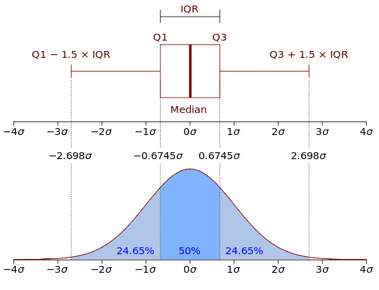

Plot the data.

#### Box plots

The upper and lower "hinges" of the box correspond to the first and third quartiles (the 25th and 75th percentiles) in the data. The middle hinge is the median value of the data. The upper whisker extends from the upper hinge (i.e., the top of the box) to the highest value in the data that is within 1.5 x IQR of the upper hinge, where IQR is the inter-quartile range (i.e., the difference between the first and third quartiles). The lower whisker extends from the lower hinge to the lowest value in the data within 1.5 x IQR of the lower hinge. Data beyond the end of the whiskers could be outliers and are plotted as points (as suggested by Tukey).

In sum: 
1. The upper whisker extends from Q3 to min(max(data), Q3+1.5*IQR)
2. The lower whisker extends from Q1 to max(min(data), Q1-1.5*IQR)

You may need to read the two lines above a few times before it sinks in. The plot below may help.

[Source](http://en.wikipedia.org/wiki/File:Boxplot_vs_PDF.svg)

#### Subset

Use Subset to select (or omit) specific sets of rows from the data. You can use > and < signs and even combine filter commands. For example, x > 3 & y == 2 would select only those rows for which the variable x has values larger than 3 __and__ for which y has values equal to 2. Type your filter statement in the Subset box and press enter to see the result on screen. 

&copy; Vincent Nijs (2014) 

